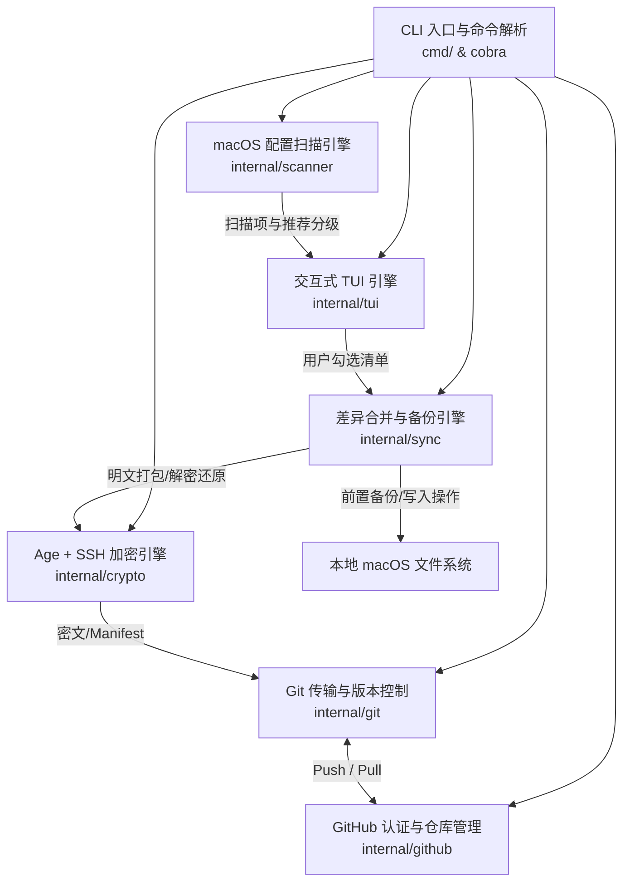
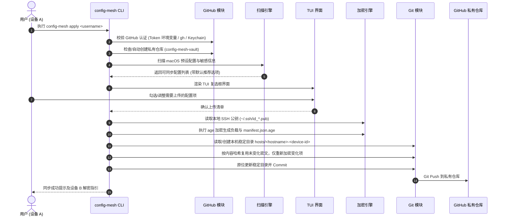
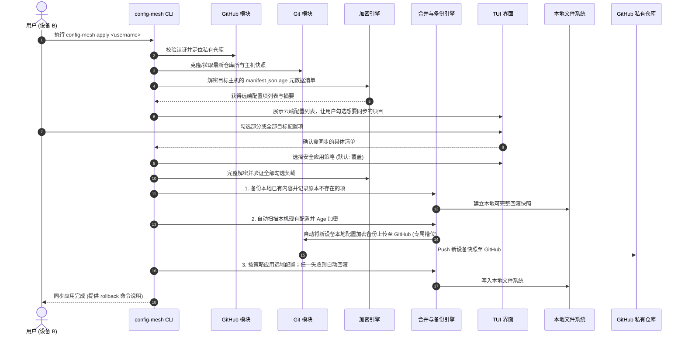

# config-mesh 系统架构与设计文档

`config-mesh` 是一款面向 macOS 开发者的交互式配置归档与同步工具。它通过 **GitHub 私有仓库** 托管快照，并利用 **本地 SSH 公私钥进行端到端内容加密**（基于 `age` 规范），通过 **终端 TUI 复选框界面** 让用户明确选择上传项、下载快照和应用策略。

---

## 1. 核心目标与特性

1. **零服务端依赖**：以用户的 GitHub 私有仓库作为后端存储，无需搭建第三方服务器。
2. **端到端内容加密**：配置和 Manifest 使用本地 SSH 密钥对（`ed25519` / `rsa`）加密解密；GitHub 可见接收者公钥以及快照时间/主机名，但不可见配置内容和路径清单。
   - 安全边界：age 校验密文完整性，但不认证发送设备。v1.0.0 没有快照签名/信任链；拥有仓库写权限者可用公开接收者密钥构造新的可解密快照，因此交互式快照选择不能等同于来源认证。
3. **开箱即用的 macOS 扫描器**：自动发现并推荐 AI 助手（Claude Code / Codex / Gemini / Antigravity / Cursor）、云平台 CLI（AWS / 阿里云 / GCloud）、SSH、Shell、Git、Neovim、VSCode 等常见配置，**智能过滤本地不存在的文件**。
4. **TUI 交互**：基于 `bubbletea` 的滚动分类复选列表；每个分类标题是三态总复选框，支持分类全选、单项选择、全局全选/取消/反选和翻页。
5. **多设备稳定槽位与版本控制**：
   - 每台设备持久化随机 `device_id`，仓库目录固定为 `hosts/<hostname>-<device-id-prefix>/`；
   - 后续上传原位更新该目录；历史版本由 Git commit 保存，不制造重复目录。
6. **交互式挑选与双重前置备份**：
   - 在目标设备下载/合并前，TUI 列出远程所有配置项供用户按需挑选勾选；
   - **用户确认后，先针对勾选命中的本地现有配置执行强制自动快照备份**；
   - **同时自动扫描本机现有开发配置，加密备份并上传至 GitHub 仓库（本机专属设备槽位 `hosts/<hostname>-<device-id>/`）**，然后再执行写入/合并。
7. **智能差异合并与安全防护**：
   - 安全默认为覆盖；可选 Shell/Git 标记块、JSON 深度合并和目录 overlay。TOML/YAML/JSONC 不做未经证明的通用追加。
   - 使用 `secret_kind` 路径白名单支持显式凭据同步；未声明或路径不匹配的敏感文件继续拒绝。
8. **配置大小精确计算与实时统计**：
   - 递归计算常规文件与目录配置（如 Neovim/VSCode 目录）的精确字节大小；
   - TUI 界面行内显示单项大小（如 `(2.4 KB)`），并在底部动态实时汇总已选配置的总数据量。

---

## 2. 总体架构设计

系统划分为以下六大核心模块：



### 模块职责说明

| 模块 | 包路径 | 核心职责 |
| :--- | :--- | :--- |
| **CLI 入口** | `cmd/` | 命令解析、参数校验、流程串联与上下文管理 |
| **GitHub 管理** | `internal/github` | `GITHUB_TOKEN` / `GH_TOKEN` / `gh` / Keychain 认证，校验并创建私有仓库 |
| **加密与密钥** | `internal/crypto` | SSH 多接收者 age 加密、加密私钥解锁与 `recipients.pub` 管理 |
| **配置扫描** | `internal/scanner` | macOS 常见配置探测、SSH/云凭据发现、受控凭据白名单与普通敏感文件拦截 |
| **TUI 界面** | `internal/tui` | 滚动视口、分类三态总复选框、差异徽章、按需勾选与策略选择 |
| **Git 引擎** | `internal/git` | 本地仓库克隆/初始化、Commit、Push、Pull、稳定设备目录暂存与原子替换 |
| **同步与备份** | `internal/sync` | 不存在状态备份、负载/路径验证、原子目录替换、JSON 合并和失败回滚 |

本地差异基线按 `owner/repository` 隔离保存为 `~/.config-mesh/states/<vault-sha256>.json`。该 JSON 哈希表记录设备 ID、稳定上传目录、每项选择状态、本地/远端/负载哈希及最近同步时间；`active-vault` 仅指向最近成功同步的 vault，避免切换仓库时沿用另一仓库的哈希和删除记录。

---

## 3. 核心业务流程

### 3.1 设备 A：首次同步与配置推送流程



---

### 3.2 设备 B：拉取挑选、双重前置备份（本地+云端）与配置合并流程



---

## 4. 关键设计细节

### 4.1 稳定设备目录与增量上传 (`internal/git`, `internal/state`)

1. 首次上传生成 128-bit 随机 `device_id`，持久化到 vault 隔离状态文件；设备改名不会改变已有上传目录。
2. 仓库槽位命名为 `${sanitized-hostname}-${device_id前12位}`。后续同步始终构建临时目录，完整成功后再原子替换同一槽位。
3. Manifest 和本地状态保存内容哈希、负载哈希及 `recipients.pub` 哈希。内容未变化且接收者未变化时直接复用已有 age 密文；接收者变化时全部重新加密。
4. 选择集合和内容均未变化时不改仓库、不创建空 commit，但仍执行 push 以恢复先前失败的远端推送。本机只更新时间记录。
5. `snapshot-meta.json` 的 `CreatedAt` 表示该设备槽位最近一次内容更新时间；下载列表据此排序。旧版日期目录保留兼容读取，但不会继续按旧算法新增。
6. 下载选择列表用本机状态中的 `upload_snapshot_id` / `device_id` 标识 `[本机]`、`[其他设备]` 或 `[设备未知]`，避免把自己的上传槽位误当成其他设备来源。

### 4.2 端到端加密与密钥模型 (`internal/crypto`)

1. **加密算法**：
   - 采用 **Age Encryption** 规范（`filippo.io/age`）。
   - 支持解析标准 SSH 公钥：`ssh-ed25519`（推荐）及 `ssh-rsa`。
2. **多设备协同解密**：
   - **多接收者加密（Multi-recipient）**：Age 原生支持使用多个公钥加密同一数据体。
   - 已授权设备使用 `config-mesh key add <pubkey> [owner]` 把新设备公钥写入 `recipients.pub`，之后的快照同时加密给所有接收者。
   - 历史快照不自动 rekey。下载会尝试所有本地私钥，并对加密 SSH 私钥隐藏输入 passphrase。

### 4.3 受控凭据同步与敏感文件策略 (`internal/scanner`)

凭据是产品同步对象，但不能用一个通用布尔字段绕过路径验证。Manifest 使用 `secret_kind`，客户端验证“类型、精确路径、负载格式”三者一致：

- `ssh_private_key`：仅允许 `~/.ssh/` 直属的可解析 SSH 私钥；排除 `authorized_keys`、`known_hosts`、`config`，并同时发现对应 `.pub` 文件。
- `aws_credentials`：仅允许 `~/.aws/credentials`，要求包含 Access Key ID 与 Secret Access Key 字段。
- `aliyun_config`：仅允许 `~/.aliyun/config.json`，要求是有效的非空 JSON 对象。
- `detected_config_secret`：仅允许扫描器内置的普通单文件预设（例如 `~/.zshrc`）；内容必须实际命中凭据检测。它不会再被扫描器静默丢弃。

显式凭据项默认不勾选；检测到凭据的推荐配置（例如 `~/.zshrc`）保留其推荐选择状态。所有敏感项上传和下载均需输入 `SYNC-SECRETS` 二次确认，只能使用 overwrite，落盘权限强制为 `0600`。未列入预设或白名单的 `.env*`、kubeconfig、GPG 私钥和证书私钥仍被拒绝。

### 4.4 交互挑选、差异同步与合并策略 (`internal/sync`)

1. **下载前交互勾选**：
   - 设备 B 在下载前列出云端所有项目，用户可自由选择同步全部或仅同步某几项（如仅同步 `.zshrc` 和 `VSCode`，不同步 `Git`）。
2. **精准前置快照备份**：
   - 对本地已存在的文件做快照，同时记录原本不存在的项，存储于 `~/.config-mesh/backups/<timestamp>/`。
   - 附带 `backup-manifest.json` 记录原始路径、权限与哈希，支持 `config-mesh rollback` 完整还原。
   - 备份为本机明文副本，`~/.config-mesh/backups/` 强制使用 `0700`；它不属于云端 age 加密边界。
3. **差异合并策略**：

| 配置类型 | 示例 | 可选追加/合并行为 | 默认覆盖行为 |
| :--- | :--- | :--- | :--- |
| **纯文本/Shell 脚本** | `.zshrc`, `.bashrc` | **锚点标记块追加**：<br>`# >>> config-mesh start >>>`<br>`...内容...`<br>`# <<< config-mesh end <<<`<br>再次同步时只更新标记块，不产生重复 | 全量覆盖原文件 |
| **JSON 数据** | `settings.json` | **Key-Value 深度合并（Deep Merge）**：保留本地特有键，合并远端键；解析失败会中止 | 全量覆盖原文件 |
| **目录级配置** | `~/.config/nvim/` | **差异增量同步**：新增缺失文件，保留本地特有文件 | 清空后整体替换为云端版本 |

### 4.5 AI 助手与 IDE 运行期大缓存智能排除机制 (`internal/scanner`)

为确保同步过程轻量、快速且不占用无谓的云端存储空间，系统内置了对现代 AI 工具与 Electron IDE 的深度缓存拦截引擎：
- **AI 会话与索引**：严格排除 `brain/` 对话快照、`sessions/`、`transcripts/`、`index/` (LanceDB 向量库)、`models/` (LLM 模型二进制权重)；
- **IDE 运行缓存**：排除 `History/` 时间轴、`workspaceStorage/`、`globalStorage/`、`Code Cache/`、`GPUCache/`、`extensions/`（插件二进制）；
- **动态计算与打包**：扫描计算字节大小与生成 tar 归档时实时过滤，实现真正的“零冗余纯配置同步”。

---

## 5. 云端仓库目录结构规范

用户 GitHub 私有仓库（如 `https://github.com/<username>/config-mesh-vault`）中存储的文件结构如下：

```
config-mesh-vault/ (私有仓库)
├── recipients.pub                # 多设备 SSH 公钥接收者清单
└── hosts/                        # 主机与多设备归档区
    ├── macbook-pro-a1b2c3d4e5f6/ # 主机 A 的稳定槽位；后续原位更新
    │   ├── snapshot-meta.json    # 不含配置路径的公开排序元数据
    │   ├── manifest.json.age     # 加密的元数据清单 (包含路径映射、负载哈希、权限)
    │   └── vault/                # 加密存储区
    │       ├── shell_zshrc.age           # 加密后的 ~/.zshrc
    │       ├── git_gitconfig.age         # 加密后的 ~/.gitconfig
    │       ├── ssh_config.age            # 加密后的 ~/.ssh/config
    │       └── vscode_settings.json.age  # 加密后的 VSCode 配置
    └── imac-112233445566/         # 主机 B 的稳定槽位
        ├── manifest.json.age
        └── vault/
            └── ...
```

---

## 6. CLI 命令行设计

基于 `cobra` 构建清晰的命令体系：

```bash
# 核心一键命令 (自动检测初次上传或多端合并)
config-mesh apply [github_username]

# 辅助子命令
config-mesh scan               # 仅扫描并输出本地可同步项
config-mesh status             # 比对本地与上次同步基线
config-mesh key add <pubkey> [owner] # 添加新设备 SSH 公钥
config-mesh rollback           # 回滚历史备份版本
config-mesh version            # 查看版本信息
```

---

## 7. 技术栈清单

- **编程语言**：Go 1.25.13 或更高补丁版本（与 `go.mod` 的安全下限一致）
- **CLI 框架**：`github.com/spf13/cobra` + `github.com/spf13/pflag`
- **TUI 交互**：`github.com/charmbracelet/bubbletea` + `bubbles` + `lipgloss`
- **加密体系**：`filippo.io/age`（含 `filippo.io/age/agessh` 原生 SSH 密钥支持）
- **GitHub API**：`github.com/google/go-github/v60` + `golang.org/x/oauth2`
- **Git 存储**：系统 `git` 命令（Token 只通过子进程临时 Authorization Header 传递）
- **系统安全存储**：`github.com/zalando/go-keyring`（macOS Keychain 支持）
